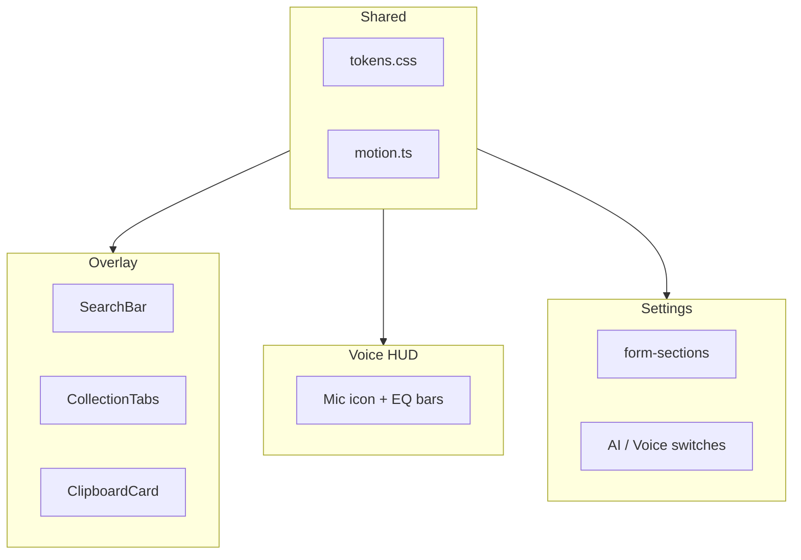
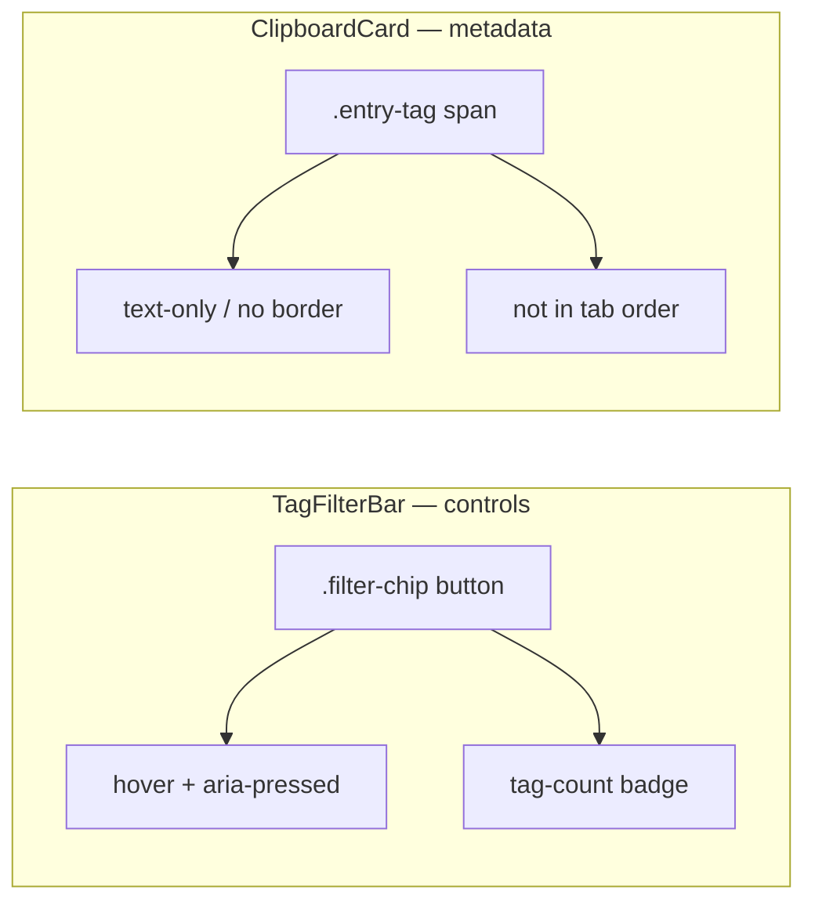
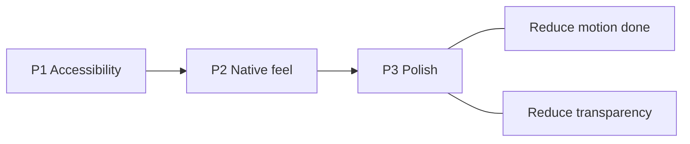

# Copyosity UI — аудит по Apple HIG

Глобальный аудит UI Copyosity по [Apple Human Interface Guidelines](https://developer.apple.com/design/human-interface-guidelines/): clipboard overlay, voice HUD, settings и shared design system. Один файл — общие пункты (motion, tokens, transparency) правятся и отмечаются один раз.

**Прогресс:** только чекбоксы в чеклисте и `✅` в детальных разделах. Без статусных подписей («отложено», «отдельный PR», даты review и т.п.) — всё в списке будет сделано, пункт за пунктом.

**Метки scope:** `[Overlay]` clipboard panel · `[Settings]` settings window · `[Voice]` voice HUD · `[Shared]` tokens / form-controls / button-interaction / motion helper

| Поверхность | Файлы |
| ----------- | ----- |
| Clipboard overlay | [`+page.svelte`](../../src/routes/+page.svelte), [`ClipboardCard.svelte`](../../src/lib/components/ClipboardCard.svelte), [`TagFilterBar.svelte`](../../src/lib/components/TagFilterBar.svelte), [`SearchBar.svelte`](../../src/lib/components/SearchBar.svelte), [`CollectionTabs.svelte`](../../src/lib/components/CollectionTabs.svelte) |
| Voice HUD | [`overlay/+page.svelte`](../../src/routes/overlay/+page.svelte) |
| Settings | [`settings/+page.svelte`](../../src/routes/settings/+page.svelte), [`SectionIcon.svelte`](../../src/lib/components/SectionIcon.svelte) |
| Shared | [`tokens.css`](../../src/lib/styles/tokens.css), [`form-controls.css`](../../src/lib/styles/form-controls.css), [`button-interaction.css`](../../src/lib/styles/button-interaction.css), [`motion.ts`](../../src/lib/motion.ts) |

---

## Чеклист (roadmap)

### P1 — Accessibility

- [x] `[Overlay]` Search input в Tab order; focus ring через `:focus-within` на `.search-bar` (п. 4)
- [x] `[Overlay]` убрать global `outline: none`; `focus-visible` на карточки и non-button табы (п. 1)
- [x] `[Overlay]` Paste button на карточке — primary action вместо дублирующего Copy; `Space` на card `role="button"`; `aria-busy` при activate (п. 2, 19 partial)
- [ ] `[Overlay]` hit targets 28px+ — search clear button (20px) и card action buttons (24px) (п. 3)
- [x] `[Shared]` Контраст `--color-text-subtle` / `--color-text-faint`; `prefers-contrast: more` (п. 5)
- [x] `[Shared]` `form-input` / `form-select`: pointer vs keyboard focus rings через `input-modality` (п. 23)
- [x] `[Settings]` Custom model input без связанного `<label>` при preset `__custom__` (п. 25)
- [x] `[Voice]` Baseline live region на HUD при записи (п. 31 — partial)
- [ ] `[Voice]` Полный SR lifecycle (recording → processing → result) → [04-voice-hud-accessibility-full-cycle.md](04-voice-hud-accessibility-full-cycle.md)

### P2 — Native feel

- [x] `[Overlay]` `⌘F` / `/` → search; `←/→` зарезервированы под карточки (п. 4)
- [ ] `[Overlay]` Keyboard hints — контекстный hint в `SearchBar` + footer strip в `+page.svelte` (п. 19)
- [ ] `[Overlay]` Segmented control для History / Starred; tablist ARIA; упростить header (п. 8–9)
- [x] `[Overlay]` SF Pro для plain text, SF Mono только для code-like preview (п. 11)
- [ ] `[Overlay]` Развести визуально filter chip (toolbar) и metadata badge (footer карточки) (п. 41)
- [ ] `[Settings]` Toggle / section patterns вынести в `form-controls.css` (п. 26)

### P3 — Polish

- [x] `[Overlay]` Empty state fix (фильтр по тегу / search) (п. 18)
- [x] `[Overlay]` Убрать `title` tooltip с карточки (п. 14)
- [ ] `[Overlay]` Delete undo / confirm (п. 12)
- [ ] `[Settings]` Clear history без confirm / undo (п. 22)
- [x] `[Shared]` `prefers-reduced-motion` — полное покрытие (п. 20)
- [x] `[Shared]` `prefers-reduced-transparency` — blur fallback (п. 6, 21)
- [x] `[Overlay]` Image meta labels (dimensions вместо «Image preview») (п. 17)
- [ ] `[Shared]` Убрать дублирование `title` + `aria-label` на toggles и list actions (п. 24)

### P4 — Native depth

- [ ] `[Shared]` SF Symbols вместо custom stroke SVG (п. 15)
- [ ] `[Shared]` Native vibrancy / light mode (`prefers-color-scheme: light`) (п. 7)
- [ ] `[Overlay]` VoiceOver listbox (п. 34)
- [x] `[Overlay]` Scroll affordances на tag bar (п. 10)

---

## Что уже хорошо

| Область | Scope | Реализация |
| ------- | ----- | ---------- |
| Panel / HUD | Overlay, Voice | Прозрачные NSPanel-окна, `alwaysOnTop`, без кражи фокуса |
| Settings layout | Settings | Секции `form-section`, status steps, Ollama onboarding states по product policy |
| Системный шрифт | Overlay, Settings | `-apple-system, BlinkMacSystemFont` |
| Семантические цвета | Shared | danger / warning / success / accent tokens |
| Focus ring на кнопках | Shared | `button.app-btn:focus-visible` |
| Form focus | Shared | `form-input:focus` ring (`--ring-accent-input`) |
| Motion | Shared | Reduce Motion: panel, scroll, pulse, spinner, hover, copied, EQ bars, micro-transitions via tokens |
| Search field | Overlay | `role="search"`, clear button, `:focus-within` ring |
| Empty state | Overlay | Контекстные сообщения, `role="status"` |
| Toggles a11y | Settings | `role="switch"`, `aria-label`, `focus-visible` ring на slider |

---

## Clipboard overlay (п. 1–19, 41)

### ✅ 1. Глобальное отключение outline `[Overlay]`

Убран global `outline: none` в `+page.svelte`; `focus-visible` ring на карточках (`ClipboardCard`) и div-табах коллекций (`CollectionTabs`).

### ✅ 2. Действия карточки при keyboard selection `[Overlay]`

`.card-actions` показываются при `.selected`, `:focus-within` и hover; action buttons используют `aria-label`.

**Сделано в 0.4.0:** redundant Copy заменён на primary **Paste** (`activateEntry`, accent styling, `aria-busy` при activate); клик по карточке по-прежнему копирует; paste также через double-click, Enter, Space на card `role="button"`, и Paste toolbar button.

### 3. Hit targets ниже minimum `[Overlay]`

Search clear 20×20 px; card action buttons 24×24 px. HIG: 28×28 pt minimum.

### ✅ 4. Поиск с клавиатуры `[Overlay]`

`⌘F`, `/`, `←/→`, `Escape`, Unicode search в БД.

**Follow-up:** стрелки в search не двигают курсор — нужны keyboard hints (п. 19).

### ✅ 5. Контраст вторичного текста `[Shared]` `[Overlay]`

`--color-text-subtle` / `--color-text-faint` осветлены; `@media (prefers-contrast: more)` в `tokens.css`.

### ✅ 6. Material / Vibrancy `[Overlay]` `[Voice]` `[Shared]`

| Слой | Файл | Blur |
| ---- | ---- | ---- |
| Overlay panel | `+page.svelte` | `--panel-blur-visible` (34px) |
| Voice HUD | `overlay/+page.svelte` | 12px |
| Copied overlay | `ClipboardCard.svelte` | 6px |

`prefers-reduced-transparency`: opaque token fallback, blur off. Settings (`--surface-page` 96% opaque) менее критичен.

### 7. Только Dark `[Shared]`

Нет light-токенов и `prefers-color-scheme: light`.

### 8. Tabs — не segmented control `[Overlay]`

`CollectionTabs.svelte`: нет `aria-selected` / `role="tablist"`; collection tabs — `
`; delete `×` только on hover.

### 9. Перегруженный header `[Overlay]`

Search + tabs + collections + Exclude + gear в одной строке. Exclude → overflow; search flex-grow.

### ✅ 10. Tag filter bar `[Overlay]`

Скрытый scrollbar; шрифт 12px; scroll fade. **Follow-up:** конфликт ролей с тегами на карточке — п. 41.

### ✅ 11. Моноширинный шрифт для всего preview `[Overlay]`

SF Mono на всём тексте карточки. HIG: SF Pro для body, Mono только для code.

### 12. Delete без подтверждения `[Overlay]`

Одно нажатие X удаляет запись. См. единый паттерн п. 29.

### 13. Selection vs Hover states `[Overlay]`

Selected card должен быть самым контрастным состоянием.

### ✅ 14. Native tooltip на карточке `[Overlay]`

`title={entry.text_content}` — убрать; Quick Look по `Space` (future).

### 15. Иконография — не SF Symbols `[Shared]`

Custom stroke SVG в overlay и settings.

### ✅ 16. Search field styling `[Overlay]`

Clear button, `:focus-within` ring, `role="search"`, `aria-label`.

### ✅ 17. Image cards — redundant label `[Overlay]`

«Image preview» → dimensions / file size.

### ✅ 18. Empty state copy `[Overlay]`

Контекстные сообщения при search / tag filter; `role="status"`.

### 19. Discoverability paste model и keyboard shortcuts `[Overlay]`

**Сделано (partial):** Paste button на карточке — явный mouse affordance для вставки без double-click.

**Осталось:** footer shortcut strip в `+page.svelte` и контекстный hint в `SearchBar` при focus. Рекомендуемый copy:

| Зона | Hint |
| ---- | ---- |
| Footer strip | `Click copy` · `↵ paste` · `Double-click paste` · `← → browse` · `Esc dismiss` |
| Search focus | `← → browse results` · `↵ paste selected` |

Paste button в toolbar не дублировать в footer дословно — достаточно «↵ paste» / «Double-click paste», т.к. кнопка видна при hover/selection.

### 41. Filter chip vs metadata badge — конфликт ролей `[Overlay]` `[Shared]`

**Проблема.** Верхняя полоса (`TagFilterBar`) и footer карточки (`ClipboardCard`) используют одинаковую pill-морфологию и общее имя класса `.tag-chip`, хотя роли разные:

| Зона | Элемент | Роль | Поведение |
| ---- | ------- | ---- | --------- |
| Row B, toolbar | `<button class="tag-chip">` | **Filter chip** — контрол списка | Клик / `aria-pressed` переключает `activeTag`, меняет набор карточек; у semantic/format chips есть счётчик |
| Footer карточки | `` | **Metadata badge** — описание записи | Только информирует (AI-теги текста); не в tab order, без hover |

Семантика HTML корректна (`button` vs `span`), но визуальный язык почти общий: `border-radius: 999px`, accent-tint фон на карточке, lowercase, похожий масштаб. Для semantic-тегов различие сводится к счётчику и ~2px padding — на экране `api 2` вверху и `api` внизу читаются как один и тот же паттерн.

**Почему это против HIG.** [Buttons](https://developer.apple.com/design/human-interface-guidelines/buttons) и affordances: интерактивное должно явно отличаться от статичной метки. Пользователь ожидает, что pill в toolbar фильтрует, а pill на объекте — его свойство; при одинаковом виде возникает ложный affordance (клик по тегу на карточке) и путаница «это тот же контрол?». Нативные паттерны (Finder: фильтр по тегу в sidebar vs цветная метка на файле; Mail: smart mailbox vs поле письма) разводят **control** и **label**.

**Текущая реализация.**

- [`TagFilterBar.svelte`](../../src/lib/components/TagFilterBar.svelte): `padding 6×11`, `font-size 12px`, border, hover/active, `.tag-count`.
- [`ClipboardCard.svelte`](../../src/lib/components/ClipboardCard.svelte): `padding 4×8`, `font-size 10px`, `--surface-accent-tag` / `--border-accent-tag` — всё ещё «кнопочный» chip.

Связанный product scope: при `aiTaggingEnabled === false` footer-теги скрыты ([03-overlay-content-and-tag-filters.md](03-overlay-content-and-tag-filters.md)); исправление касается режима AI ON.

**Решение (визуальное, без смены product logic).**

Развести **два компонентных стиля** и **два набора токенов** — filter остаётся chip-кнопкой, карточка получает тихую metadata-строку.

| Аспект | Filter chip (toolbar) | Metadata badge (card footer) |
| ------ | --------------------- | ---------------------------- |
| Класс | `.filter-chip` (переименовать из `.tag-chip` в `TagFilterBar`) | `.entry-tag` (переименовать в `ClipboardCard`) |
| Форма | Pill + `1px` border, явный фон | **Без pill-обводки** — inline labels или одна строка через `·` |
| Фон | `--surface-3` / `--surface-5`; active: `--surface-accent` | `transparent` или едва заметный `--surface-2` без accent |
| Текст | `--color-text-secondary`; active: `--color-accent-chip` | `--color-text-subtle` (не accent) |
| Размер | 12px, `padding 6×11` | 10–11px, `padding 0` или `2×0` |
| Счётчик | `.tag-count` — остаётся только у filter | Нет |
| Курсор | `pointer` + hover из `app-btn` | `default` — не намекать на клик |
| Клик по тегу на карточке | — | **Не делаем** в этом пункте (иначе снова chip + нужен `aria-pressed`); фильтрация только из toolbar |

**Конкретные правки (implementation checklist).**

1. **`tokens.css`** — добавить `--color-entry-tag` (= `--color-text-subtle` или чуть приглушённее); пометить `--surface-accent-tag` / `--border-accent-tag` как deprecated для card footer (можно оставить для других badge, если появятся).
2. **`TagFilterBar.svelte`** — `.tag-chip` → `.filter-chip`; стили не менять существенно (уже читается как control).
3. **`ClipboardCard.svelte`** — заменить блок `.tags` на metadata-строку:
   - вариант A (рекомендуемый): `{#each tags}` → `` с `·` между элементами через CSS `+ .entry-tag::before { content: "·"; }`;
   - вариант B: одна строка `tags.join(" · ")` в `.entry-tags` без отдельных pill.
4. **Не дублировать** имя `tag-chip` между файлами — разные BEM-блоки снижают риск регрессии при правке одного слоя.
5. **Manual QA:** AI ON, карточка с `api` + filter `api 2` — визуально разные слои; hover только на toolbar; VoiceOver: card tags не объявляются как кнопки.

**Критерий готовности.** Filter chip и metadata badge различимы без чтения счётчика; на карточке нет border/hover/accent-chip, характерных для toolbar; п. 10 и п. 41 закрыты вместе одним PR.

---

## Shared / Motion & Materials (п. 20–21)

### ✅ 20. `prefers-reduced-motion` `[Shared]`

| Область | Файл | Reduce Motion |
| ------- | ---- | ------------- |
| Micro-transitions | `tokens.css` | `--duration-fast/standard/micro/hud/stagger` → `0.01ms` / `0ms` |
| Panel open/close | `+page.svelte` | `transition-duration: 0.01ms` (+ tokens) |
| Scroll к карточке | `motion.ts` | `behavior: "auto"` |
| Status dot checking | `form-controls.css` | статичный цвет |
| Tagging test spinner dot | `form-controls.css` | то же (`.checking`) |
| Voice mic pulse | `overlay/+page.svelte` | без animation |
| Voice EQ bars | `overlay/+page.svelte` | без stagger/wobble/height transition |
| Button spinner | `button-interaction.css` | замедлен (`--duration-spinner-reduced`) |
| Settings toggles | `settings/+page.svelte` | `transition: none` на slider |
| Card hover | `ClipboardCard.svelte` | без `translateY` |
| Copied feedback | `ClipboardCard.svelte` | fade вместо scale |

### ✅ 21. `prefers-reduced-transparency` `[Shared]`

Opaque surface tokens в `tokens.css`; `backdrop-filter: none` в `+page.svelte`, `overlay/+page.svelte`, `ClipboardCard.svelte`.

---

## Settings (п. 22–29)

### 22. Clear history без подтверждения `[Settings]`

`form-btn-danger` «Clear unpinned history» — одно нажатие, только toast-notice после. Аналог п. 12.

**Рекомендация:** confirm dialog или «Cleared — Undo».

### ✅ 23. Form controls: pointer vs keyboard focus `[Shared]`

WebKit в Tauri часто показывает `:focus-visible` при клике мышью. Решение: `input-modality.ts` выставляет `data-input-modality` на `<html>`; `form-controls.css` даёт tight ring на `:focus`, а 3px keyboard halo — только при `[data-input-modality="keyboard"]`.

### 24. Дублирование `title` и `aria-label` `[Settings]` `[Overlay]`

Toggles, exclude list actions, overlay exclude button — `title` дублирует `aria-label`.

**Рекомендация:** оставить `aria-label`; убрать `title`.

### ✅ 25. Custom model input `[Settings]`

При `__custom__` — `<label for="custom-ollama-model">` + связанный input.

### 26. Toggle styles локальны `[Settings]` `[Shared]`

`.toggle` / `.toggle-slider` только в `settings/+page.svelte`. Вынести в `form-controls.css`.

### ✅ 27. Ollama onboarding `[Settings]`

Status steps соответствуют product policy в `CLAUDE.md`. Spinner / checking dots покрыты Reduce Motion.

### 28. Settings `user-select: none` на body `[Settings]`

Глобально на `body`; inputs переопределяют на `text`. Hint `<code>` не selectable — minor.

### 29. Danger / destructive actions pattern `[Settings]` `[Overlay]`

Единый паттерн: overlay delete (п. 12) и settings clear history (п. 22). Исправлять одним решением (toast + undo).

---

## Voice HUD (п. 30–32)

### ✅ 30. EQ bars и mic — live feedback `[Voice]`

Reduce Motion: mic без pulse; bars — uniform height по level, без wobble/stagger/height transition (`motion.ts` + CSS).

### ~31. Accessibility при записи `[Voice]` (baseline)

**Сделано (baseline):** `role="status"` + `aria-live="polite"` на overlay root; декоративный контент в `aria-hidden` wrapper; sr-only «Recording voice».

**Остаётся:** полный screen-reader lifecycle (повторные сессии, processing, terminal states) — [04-voice-hud-accessibility-full-cycle.md](04-voice-hud-accessibility-full-cycle.md) (источник истины для voice a11y).

### ✅ 32. Blur без transparency fallback `[Voice]`

`prefers-reduced-transparency` — см. п. 6, 21.

---

## Низкий приоритет (п. 33–40)

| # | Scope | Тема |
| - | ----- | ---- |
| 33 | Shared | Dynamic Type — фиксированные px |
| 34 | Overlay | VoiceOver listbox / `aria-label` на карточках |
| 35 | Overlay | Pin indicator — только border-color |
| 36 | Overlay | Horizontal scroll-snap |
| 37 | Overlay | Card width 220px fixed |
| 38 | Overlay | Collections color dot 8px |
| 39 | Settings | Test button `disabled` без `aria-describedby` при `modelDirty` |
| 40 | Overlay | Add-collection inline input — нет `focus-visible` ring |

---

## Roadmap

| Приоритет | Задачи | Файлы |
| --------- | ------ | ----- |
| **P1** | Focus visible, card actions, contrast, form focus-visible, voice a11y baseline | overlay components, `form-controls.css`, `overlay/+page.svelte` |
| **P2** | Keyboard hints, segmented tabs, font by type, filter vs metadata badges (п. 41), toggle in form-controls | `TagFilterBar.svelte`, `ClipboardCard.svelte`, `tokens.css`, `settings/+page.svelte` |
| **P3** | Delete/clear undo, tooltips, image meta, transparency, light mode | multiple |
| **P4** | SF Symbols, VoiceOver, scroll affordances | multiple |

---

## Референсы HIG

- [Materials](https://developer.apple.com/design/human-interface-guidelines/materials)
- [Accessibility](https://developer.apple.com/design/human-interface-guidelines/accessibility)
- [Buttons](https://developer.apple.com/design/human-interface-guidelines/buttons)
- [Labels](https://developer.apple.com/design/human-interface-guidelines/labels)
- [Search fields](https://developer.apple.com/design/human-interface-guidelines/search-fields)
- [Segmented controls](https://developer.apple.com/design/human-interface-guidelines/segmented-controls)
- [Typography](https://developer.apple.com/design/human-interface-guidelines/typography)

---

## Ограничение продукта

README: «never steals focus» — trade-off с HIG launcher pattern. Решение: type-to-search без auto-focus или shortcut-only focus (`⌘F` / `/`).
